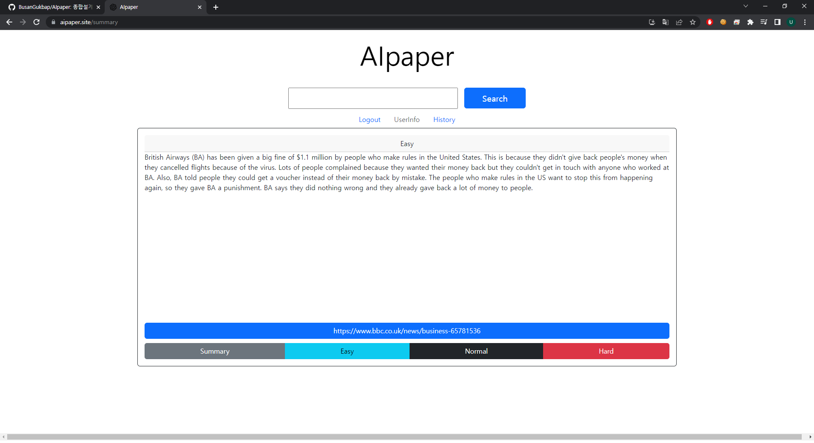

# AIpaper
종합설계프로젝트1 강의 중 "대규모 인공지능 언어모델을 이용한 서비스 개발" 과제를 수행한 결과물입니다.

*Member: **김동윤**, 김수호, 김주형, 장우석*
<br>

## 1. 서비스 개요


## 2. 주요 기능





## 3. 사용 기술
> Front-end

   
<br>

> Back-end

    
<br>

> 개발 및 배포환경

 
<br>

## 4. 리포지토리 구조
```bash
AIpaper
├── README.md
├── back
│   ├── credentials.json
│   ├── server.py
│   ├── tokens.py
│   └── utils
│       ├── Crawling.py
│       ├── Gpt.py
│       ├── Translate.py
│       └── db_access.py
└── react-app
    ├── README.md
    ├── node_modules
    ├── package-lock.json
    ├── package.json
    ├── public
    ├── response.json
    └── src
        ├── App.css
        ├── App.js
        ├── App.test.js
        ├── Pages
        │   ├── HistoryPage.js
        │   ├── Home.js
        │   ├── Join.js
        │   ├── Login.js
        │   ├── Summary.js
        │   └── Title.js
        ├── components
        │   ├── Button.js
        │   ├── InputBox.js
        │   └── OutputBox.js
        ├── index.css
        ├── index.js
        ├── logo.svg
        ├── reportWebVitals.js
        └── setupTests.js
```

## 5. 실행 방법
### 5-1. 웹페이지
[**AIpaper**](https://aipaper.site/)
<br>

<a href="https://aipaper.site/"></a>

<br>

### 5-2. 로컬 실행
1. 백엔드 서버 실행
  * `~/back/`에서 `pip install -r requirements.txt`로 필수 패키지 설치
  * `~/back/`폴더에 `tokens.py`를 추가하여 `gpt-key`, `news-key`, `firebase_key`, `app_key` 세팅
  * `~/back/`폴더에 Google Translation API key를 `credential.json`으로 저장
  * `~/back/`에서 `python server.py`로 실행

2. 프론트엔드 리액트 앱 실행
  * `~/react-app/`에서 `npm install`로 필수 패키지 설치
  * `npm start`로 실행


## 6. 팀원
|이름|역할|
|---|------------------------|
|김동윤|__Front__<br>메인 웹페이지 개발|
|김수호|__Front/Back__<br>Flask 서버 구축, 웹페이지 디자인|
|김주형|__Back/Design__<br>GPT 모델 데이터 처리, 웹페이지 디자인|
|장우석|__Back__<br>Crawling, DB 설계, Flask 서버 구축, 배포|
<br>


